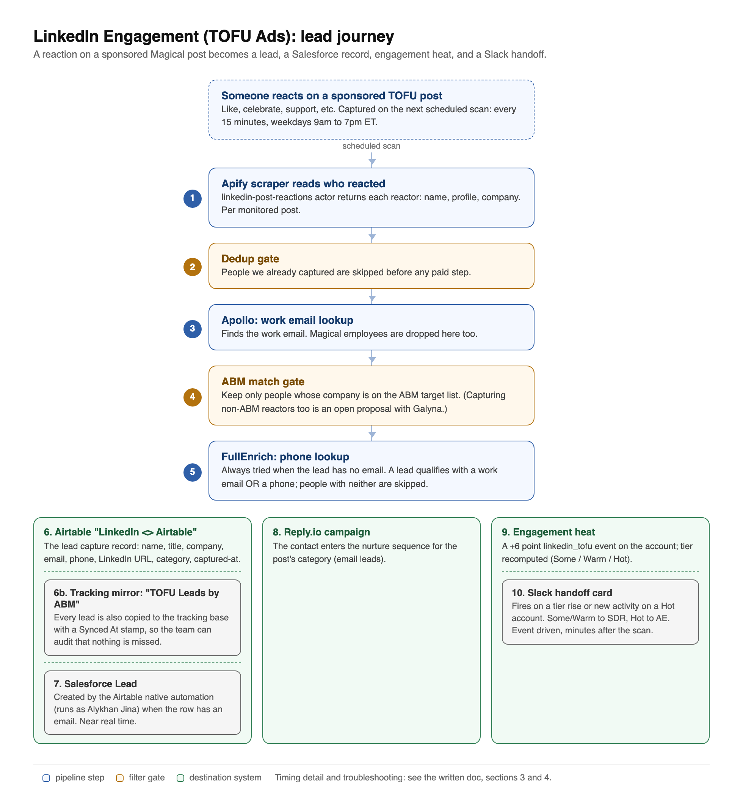

# LinkedIn Engagement (TOFU Ads): Automation and Lead Flow

**Owner:** Engineering (Sunny) · **Last updated:** 2026-07-08 · **Linear:** MAR2-13

Purpose: full visibility into how a LinkedIn ad reaction becomes a lead, a
Salesforce record, engagement heat, and a Slack handoff, so anyone on the team
can understand, monitor, and troubleshoot the automation without extra guidance.

> **Current rollout status (2026-07-08):** capture, enrichment, both Airtable
> tables, Salesforce, and Reply.io are fully live. Slack handoff cards are temporarily
> routed to a private test channel (marked [TEST]) while we verify the new
> notification rules. After a verified clean cycle they flip back to the live
> SDR and AE channels. Nothing is lost during this period: the same accounts
> remain queued and are delivered on the flip.

---

## 1. End-to-end automation flow



Text version of the same flow:

```
Someone reacts (like, celebrate, etc.) on a Magical sponsored TOFU post
      |
      v  (scheduled scan, see timing in section 3)
[1] Apify scraper (harvestapi/linkedin-post-reactions)  -> list of reactors per post
      |
      v  per reactor
[2] Dedup gate            -> people we already captured are dropped BEFORE any paid step
      |
      v
[3] Apollo email lookup   -> find a work email
      |
      v
[4] ABM match gate        -> keep ONLY people whose company is on the ABM target list
      |                      (capturing non-ABM reactors too is proposed, with Galyna)
      v
[5] FullEnrich phone      -> phone lookup (always tried when a lead has no email,
      |                      since email OR phone is what qualifies a lead)
      |
      +--> [6] Airtable "LinkedIn <> Airtable" table   (lead capture record)
      |            |
      |            +--> [6b] Tracking mirror: "ABM Flow LinkedIn <> Airtable"
      |            |         table (every lead copied, stamped Synced At — the
      |            |          audit table proving no lead is missed)
      |            v  Zapier (Alykhan's account; polls every ~5 min, email-gated)
      |       [7] Salesforce Lead   (created by the Zapier Zap)
      |
      +--> [8] Reply.io campaign   (contact enters the nurture sequence)
      |
      +--> [9] Engagement heat     (+6 point linkedin_tofu event in the platform)
                   |
                   v  account tier recomputed (Some / Warm / Hot)
              [10] Slack handoff card (SDR or AE, see section 5)
```

| # | Tool / service | Purpose | Trigger | Data in -> out |
|---|---|---|---|---|
| 1 | Apify (linkedin-post-reactions) | Scrape who reacted | Scheduled scan (`run_linkedin_tofu.py`) | post id -> list of {name, profile, company} |
| 2 | Our runner (dedup) | Skip already-captured people, no double spend | per reactor | profile id -> keep or drop |
| 3 | Apollo | Find a work email | per new reactor | name + company -> email |
| 4 | Our runner (ABM gate) | Keep only ABM target companies | per reactor | company -> keep or drop |
| 5 | FullEnrich | Phone number (best effort) | per surviving lead | contact -> phone |
| 6 | Airtable ("LinkedIn <> Airtable") | Lead capture of record | upsert (email is the key) | contact -> Airtable row |
| 6b | Airtable ("ABM Flow LinkedIn <> Airtable" table) | Tracking view of the ENGAGEMENT LEADS the ABM system produced (~40), stamped Synced At — deliberately excludes the primary table's Clay bulk rows that never became leads | after each successful primary write | lead row + Synced At -> tracking row |
| 7 | Salesforce | CRM Lead | Zapier Zap under Alykhan Jina's account (polls the table) | Airtable row -> SFDC Lead |
| 8 | Reply.io | Nurture sequence | contact added | contact -> campaign member |
| 9 | ABM platform (Postgres) | Engagement heat and account tier | event recorded | account -> linkedin_tofu +6 pts |
| 10 | Slack | SDR / AE handoff | tier rise, or new activity on a Hot account | account -> handoff card |

Note: **we push to Airtable, not directly to Salesforce.** The Salesforce Lead
is created by a Zapier Zap under Alykhan Jina's account (confirmed 2026-07-08
from Salesforce OAuth records and the consistent 4 to 6 minute creation lag,
which is Zapier's polling cycle). Reply.io and
the heat capture are ours.

---

## 2. Campaign setup

- **Campaign type:** LinkedIn Sponsored Content (TOFU ads). Monitored posts are
  listed by `share_id` in `auto_search/engagement/linkedin_tofu_shares.csv`
  (one row per ad: `share_id, category`, e.g. Ortho). Adding a new ad = adding a row.
- **Engagement trigger:** any reaction (like, celebrate, support, etc.) on those
  posts. Comments are not currently captured, reactions only.
- **Lead qualification rules (the gates, in order; email-or-phone updated 2026-07-08):**
  1. **Dedup**: a person we already captured is skipped before any paid step.
  2. **ABM match**: the reactor's company must be on the ABM target list.
     Reactors from non-ABM companies are dropped today. (Capturing them too is
     an open proposal with Galyna, tracked in Linear.)
  3. **Email OR phone qualifies a lead**: a person with a work email (Apollo)
     or a phone number (FullEnrich) becomes a lead. Only people with neither
     are skipped. Phone-only leads are keyed on their LinkedIn URL.
  4. Magical's own employees are dropped.
  - **Known gap (ticketed)**: the Airtable to Salesforce Zapier Zap currently
    creates a Lead only when the row has an email, so phone-only leads stay in
    Airtable (with Reply.io not applicable either, as an email tool) until
    that automation adds a phone-based check.
- **Enrichment:** Apollo (work email) plus FullEnrich (phone). FullEnrich runs
  for ABM leads missing a phone and for any lead missing an email (the phone is
  what qualifies those). A Clay waterfall for deeper email and phone finding
  plus verification is planned as the next enrichment upgrade.
- **Error handling and retries:** each reactor is processed independently, so
  one failure is counted and skipped and the batch always completes. Airtable
  and Reply.io writes are best effort (a failure is logged, the lead is not
  lost, the next scan retries the person because the dedup key was not
  written). Every successful run stamps a timestamp used by the cost throttle.
- **Kill switches:** the scan is gated by env flags (active hours, weekdays,
  minimum interval) and the Slack handoff has its own on/off switch and a
  per-run cap, so no bug can flood a channel or burn budget unattended.

---

## 3. Lead timeline

| Step | Expected time |
|---|---|
| User reacts on the ad | Immediate |
| Reaction captured (next scheduled scan) | Up to 15 min during weekday selling hours (see cadence below) |
| Email and phone enrichment | Seconds, inside the same run |
| Airtable row created | Same run, about 1 minute after capture |
| Salesforce Lead created | About 4 to 6 minutes after the Airtable row (Zapier polling cycle) |
| Added to Reply.io campaign | Same run |
| Engagement heat recorded, tier recomputed | Same run |
| Slack handoff (if due, see section 5) | Immediately after the run (event driven, not a separate schedule) |

**Cadence and cost (why timing matters when troubleshooting):**
- The scan runs every **15 minutes**, but only during **weekday selling hours
  (about 9am to 7pm ET)**. Outside that window a tick does nothing, before any
  spend. The reactions scraper re-bills a post's whole reaction list on every
  scan ($2 per 1,000 reactions), so the hours gate keeps cost near **$2 to
  $3 per day** instead of about $10 per day for 24/7.
- **This explains most "why is the lead not here yet" questions:** a reaction
  at 8pm ET or on a weekend is captured on the next in-window scan (next
  morning, or Monday), not instantly.

---

## 4. Data storage, dashboards, and how to verify a lead

A captured engagement lands in four places. Access and fields:

| Where | What it holds | Fields | Access |
|---|---|---|---|
| **Airtable, "LinkedIn <> Airtable" table** | The lead capture record (the monitoring table for this ticket) | Name, title, company, email, phone, LinkedIn URL, post category, captured-at timestamp | [airtable.com/appniZ6UOILREppmF](https://airtable.com/appniZ6UOILREppmF) (table "LinkedIn <> Airtable"; no access yet: ask Sunny or Alykhan for an invite) |
| **Airtable, "ABM Flow LinkedIn <> Airtable" table (tracking mirror)** | The engagement leads the ABM system produced (~40: Salesforce TOFU-campaign leads plus runner captures) — deliberately NOT the primary table's full history, which includes bulk rows that never became leads | Same columns as the primary table plus Synced At (when the pipeline wrote the row) | [airtable.com/appniZ6UOILREppmF/tblF9uEPNXYbAySY8](https://airtable.com/appniZ6UOILREppmF/tblF9uEPNXYbAySY8) (same base as the primary table) |
| **Salesforce** | The CRM Lead | Standard Lead fields plus source | Existing SFDC seats (Leads, source "TOFU Engagement Campaign") |
| **ABM platform, Engagement tab** | Account-level view: heat score, tier, last touch, and the full dated timeline of every touch | Account, tier, points per event, timestamps per event | [engagement-preview-production.up.railway.app](https://engagement-preview-production.up.railway.app) (login required; creds from Sunny. Justin, Gabe, Ben already have access) |
| **Platform database** | Raw store behind the console (one linkedin_tofu event per captured reaction) | contacts + events tables with full timestamps | Engineering only |

Note on per-lead status columns: today each stage stamps its own system (the
rows above); there is no single "status" column per lead. If the team prefers
one table with a status per stage (Salesforce created, added to Reply.io,
notified), we can add those columns to Airtable in about a day. Open question
with Galyna.

**Per-stage timestamps:** capture time is on the Airtable row (captured-at),
Salesforce stamps Lead CreatedDate, Reply.io stamps the contact add, and the
platform timeline stamps the heat event. Comparing Airtable captured-at with
SFDC CreatedDate shows the Airtable automation delay for any specific lead.

**To verify a specific lead made it through, check in this order:**
1. **Airtable row exists?** Then capture, enrichment, and the ABM gate all
   succeeded. Not there? The person either reacted outside scan hours (wait for
   the next window), had no findable work email, or is not at an ABM company.
2. **Salesforce Lead exists?** Allow about 5 minutes (Zapier polling). If
   Airtable yes but SFDC no after that, the issue is the Zapier sync, not the
   capture pipeline.
3. **Platform timeline shows the +6 event?** Open the account in the
   Engagement tab; every touch is dated. The tier shown is live.
4. **Slack card?** Only fires per the rules in section 5. An account that was
   already notified at its tier and has no new activity will not re-fire; that
   is by design, not a missed lead.

---

## 5. Slack notification rules (who gets pinged, when)

- **Tiers:** Some and Warm route to the SDR; Hot routes to the AE. Lower never
  hands off.
- **Fires on:** a tier RISE (an account crossing into Some, Warm, or Hot for
  the first time since the last notification), or **any new activity on a Hot
  account** (the Hot reactivation rule, live since 2026-07-05: a new touch on
  any Hot account, old or new, re-alerts the AE). Downward drift never fires.
- **Deduped by a ledger:** each account is recorded with the tier and latest
  touch we notified on, so the same activity can never fire twice.
- **Cutoff:** only changes after the go-live cutoff notify, so the historical
  backlog was never dumped into the channel.
- **Event driven:** the handoff check runs immediately after every capture run
  (plus a daily backstop), so cards follow the activity within minutes during
  scan hours rather than waiting for a fixed schedule.
- **Staging gate (in effect now):** while the system is in test stage, every
  card goes to a private test channel with a [TEST] prefix and plain names, and
  the queue is preserved. After human verification the same cards are released
  to the live channels with real @ mentions. This is the guard against a wrong
  card ever reaching the shared channels while rules are being tuned.
- **Caps and switches:** hard per-run cap, plus a master on/off switch.

---

## 6. Quick reference (engineering)

| Thing | Where |
|---|---|
| Runner | `scripts/run_linkedin_tofu.py` |
| Monitored ad posts | `auto_search/engagement/linkedin_tofu_shares.csv` |
| Capture, gates, enrichment | `auto_search/engagement/linkedin_ads_runner.py` |
| Heat scoring (points per touch) | `auto_search/engagement/scoring.py` (linkedin_tofu = 6) |
| Airtable table | env `AIRTABLE_BASE_ID` / `AIRTABLE_LINKEDIN_TABLE` |
| Cadence and cost gates | `LINKEDIN_TOFU_ACTIVE_HOURS_UTC`, `LINKEDIN_TOFU_WEEKDAYS_ONLY`, `LINKEDIN_TOFU_MIN_INTERVAL_HOURS` |
| Notify handoff | `scripts/run_engagement_notify.py` + `POST /api/engagement/notify-changes` |
| Test/live stage | `GET/POST /api/engagement/settings/notify-stage` |
